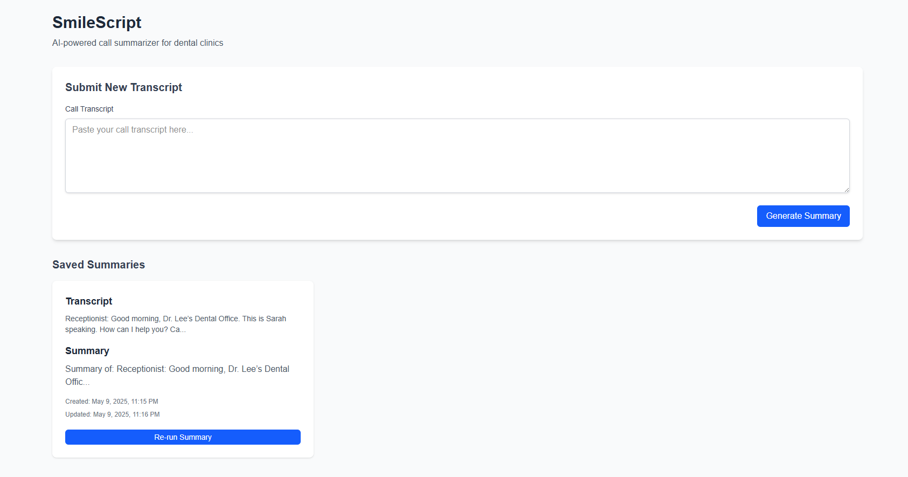

# SmileScript

SmileScript is an AI-powered call summarizer for dental clinics. This full-stack web application processes call transcripts, generates AI-powered summaries, and provides an intuitive dashboard for managing communication logs.

## 🔗 Live Demo

- **Frontend**: [SmileScript Frontend](https://smile-script.vercel.app/)
- **Backend API**: [SmileScript Backend API](https://web-production-70e58.up.railway.app/)
- **API Documentation**: [Swagger UI](https://web-production-70e58.up.railway.app/docs)
- **Loom Demo**: [SmileScript Loom Demo](https://www.loom.com/share/a279b359aa744896b7850a9939f577f6?sid=faa84fb3-5aa4-4dd6-8e0a-0e15d924fdb5)



## 🌟 Features

- **Transcript Processing**: Submit call transcripts and receive instant summaries
- **AI-Powered Summarization**: Optional OpenAI integration with fallback to mock summarization
- **Summary Management**: View, store, and re-process summaries as needed
- **Responsive Dashboard**: Clean, intuitive interface built with React and Tailwind CSS
- **RESTful API**: Well-documented FastAPI endpoints for all operations
- **Containerized Deployment**: Docker and Docker Compose support for easy setup

## 🛠️ Tech Stack

- **Frontend**:

  - Next.js with React 18
  - Tailwind CSS for styling
  - TypeScript for type safety

- **Backend**:

  - FastAPI (Python 3.11)
  - SQLAlchemy ORM
  - Pydantic for data validation

- **Database**:

  - SQLite (development)
  - Compatible with PostgreSQL for production

- **Deployment**:
  - Frontend deployed on Vercel
  - Backend deployed on Railway
  - Docker & Docker Compose for local deployment
  - Nixpacks support for cloud platforms

## 📋 Project Structure

```
smile-script/
├── backend/
│   ├── app/
│   │   ├── config.py        # Configuration and environment variables
│   │   ├── database.py      # Database connection and session management
│   │   ├── main.py          # FastAPI application and routes
│   │   ├── models.py        # SQLAlchemy models
│   │   ├── schemas.py       # Pydantic schemas for validation
│   │   └── services.py      # Business logic and external services
│   ├── .env                 # Environment variables (not in repo)
│   ├── .env.example         # Example environment variables
│   └── Dockerfile           # Backend Docker configuration
├── frontend/
│   ├── src/
│   │   ├── app/
│   │   │   ├── page.tsx     # Main page component
│   │   │   ├── layout.tsx   # Root layout component
│   │   │   ├── globals.css  # Global styles
│   │   │   └── types.ts     # TypeScript type definitions
│   ├── .env.local           # Frontend environment variables
│   └── Dockerfile           # Frontend Docker configuration
├── docker-compose.yml       # Docker Compose configuration
├── requirements.txt         # Python dependencies
├── nixpacks.toml            # Nixpacks configuration
└── README.md                # Project documentation
```

## Getting Started

### Option 1: Docker Deployment (Recommended)

1. Navigate to the project root directory
2. (Optional) Configure OpenAI API:
   - Copy `backend/.env.example` to `backend/.env`
   - Set `USE_OPENAI_API=true` to use OpenAI for summarization
   - Add your OpenAI API key to `OPENAI_API_KEY`
3. Build and start the containers:
   ```
   docker-compose up -d
   ```
4. Open [http://localhost:3000](http://localhost:3000) in your browser
5. To stop the containers:
   ```
   docker-compose down
   ```

### Option 2: Cloud Deployment (Current Production Setup)

SmileScript is currently deployed with:

- **Frontend**: Deployed on [Vercel](https://vercel.com)
- **Backend**: Deployed on [Railway](https://railway.app) using Nixpacks

To deploy your own instance:

1. **Frontend (Vercel)**:

   - Fork the repository
   - Import the project into Vercel
   - Set the environment variable `NEXT_PUBLIC_API_URL` to your backend URL
   - Deploy

2. **Backend (Railway)**:
   - Fork the repository
   - Import the project into Railway
   - Railway will automatically detect the Nixpacks configuration
   - Set the following environment variables:
     - `PORT`: The port for the application (Railway sets this automatically)
     - `USE_OPENAI_API`: Set to "true" to use OpenAI API
     - `OPENAI_API_KEY`: Your OpenAI API key
   - Deploy

The project includes all necessary configuration files:

- `Procfile`: Specifies the start command
- `nixpacks.toml`: Configures the build process
- `runtime.txt`: Specifies the Python version
- `requirements.txt`: Lists the Python dependencies

### Option 3: Local Development

#### Backend

1. Navigate to the project root directory
2. Create and activate a virtual environment:
   ```
   python -m venv venv
   source venv/bin/activate  # On Windows: venv\Scripts\activate
   ```
3. Install dependencies:
   ```
   pip install -r requirements.txt
   ```
4. (Optional) Configure OpenAI API:
   - Copy `backend/.env.example` to `backend/.env`
   - Set `USE_OPENAI_API=true` to use OpenAI for summarization
   - Add your OpenAI API key to `OPENAI_API_KEY`
5. Run the backend server:
   ```
   uvicorn backend.app.main:app --reload --host 0.0.0.0 --port 8000
   ```

#### Frontend

1. Navigate to the frontend directory:
   ```
   cd frontend
   ```
2. Install dependencies:
   ```
   npm install
   ```
3. Run the development server:
   ```
   npm run dev
   ```
4. Open [http://localhost:3000](http://localhost:3000) in your browser

## 📚 API Reference

### Endpoints

| Method | Endpoint             | Description                                   |
| ------ | -------------------- | --------------------------------------------- |
| GET    | `/`                  | Welcome message and API status                |
| POST   | `/summarize`         | Submit a transcript for summarization         |
| GET    | `/summaries`         | Retrieve all stored summaries                 |
| PUT    | `/re-summarize/{id}` | Re-generate summary for a specific transcript |

### Request/Response Examples

#### Submit a Transcript

```http
POST /summarize
Content-Type: application/json

{
  "transcript": "Hello, this is Dr. Smith's office calling to confirm your appointment tomorrow at 2 PM. Please call us back if you need to reschedule."
}
```

Response:

```json
{
  "id": 1,
  "transcript": "Hello, this is Dr. Smith's office calling to confirm your appointment tomorrow at 2 PM. Please call us back if you need to reschedule.",
  "summary": "Appointment confirmation for tomorrow at 2 PM with Dr. Smith. Call back if rescheduling needed.",
  "created_at": "2023-06-15T14:30:45.123Z",
  "updated_at": "2023-06-15T14:30:45.123Z"
}
```

#### Get All Summaries

```http
GET /summaries
```

Response:

```json
[
  {
    "id": 1,
    "transcript": "Hello, this is Dr. Smith's office calling to confirm your appointment tomorrow at 2 PM. Please call us back if you need to reschedule.",
    "summary": "Appointment confirmation for tomorrow at 2 PM with Dr. Smith. Call back if rescheduling needed.",
    "created_at": "2023-06-15T14:30:45.123Z",
    "updated_at": "2023-06-15T14:30:45.123Z"
  }
]
```

## 🔧 Configuration

### Environment Variables

| Variable              | Description                         | Default                         |
| --------------------- | ----------------------------------- | ------------------------------- |
| `USE_OPENAI_API`      | Enable OpenAI API for summarization | `false`                         |
| `OPENAI_API_KEY`      | Your OpenAI API key                 | `""`                            |
| `OPENAI_MODEL`        | OpenAI model to use                 | `"gpt-4o-mini"`                 |
| `DATABASE_URL`        | Database connection URL             | `"sqlite:///./smile_script.db"` |
| `NEXT_PUBLIC_API_URL` | Backend API URL for frontend        | `"http://localhost:8000"`       |

## 🧪 Testing

To ensure the application works as expected, you can run the following tests:

### Backend Tests

```bash
cd backend
pytest
```

### Frontend Tests

```bash
cd frontend
npm test
```

## 🤝 Contributing

Contributions are welcome! Please feel free to submit a Pull Request.

1. Fork the repository
2. Create your feature branch (`git checkout -b feature/amazing-feature`)
3. Commit your changes (`git commit -m 'feat(scope): add some amazing feature'`)
4. Push to the branch (`git push origin feature/amazing-feature`)
5. Open a Pull Request

## 📄 License

This project is licensed under the MIT License - see the LICENSE file for details.

## 🙏 Acknowledgements

- [OpenAI](https://openai.com/) for the API used in summarization
- [FastAPI](https://fastapi.tiangolo.com/) for the backend framework
- [Next.js](https://nextjs.org/) for the frontend framework
- [Tailwind CSS](https://tailwindcss.com/) for styling
- [Docker](https://www.docker.com/) for containerization
